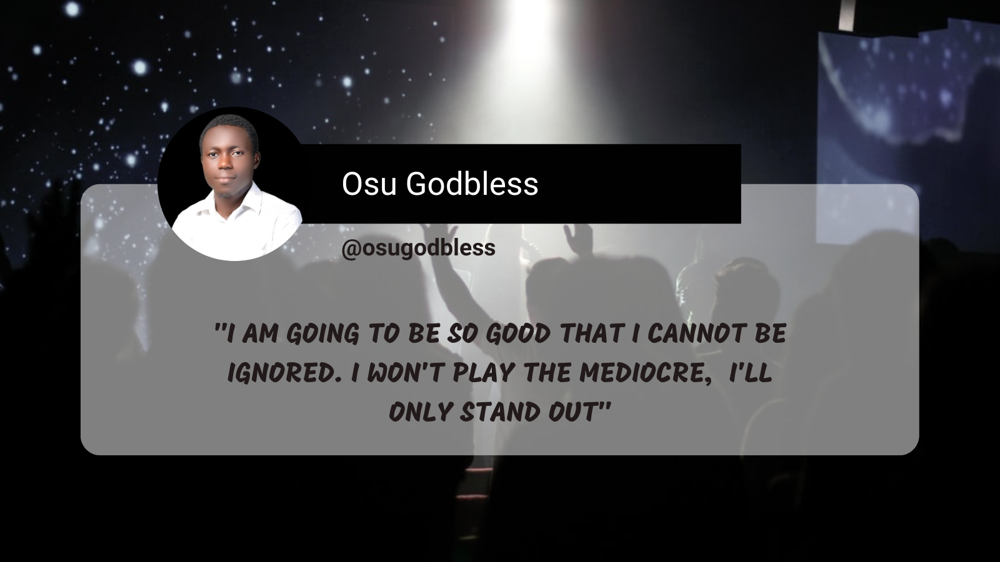

## Hi there 👋 I'm **Godbless Lucky Osu**

I'm a dynamic Cloud Engineer and DevOps enthusiast driven by a profound enthusiasm for harnessing technology to solve complex problems. I first became interested in tech when I took an introductory HTML & CSS course during my time as a molecular laboratory intern.

Driven by a relentless pursuit of professional growth, I enrolled in and graduated from a Cloud computing course, offered by the African Leadership Xcelerator (ALX), a company dedicated to delivering world-class tech training to millions of people in Africa. As a result, I am proud to hold the AWS Solutions Architect certification, a testament to my commitment to mastering cloud technologies. Currently, I am on a quest to gain more hands-on experience with various Cloud technologies, DevOps tools, and subsequently, achieve more certifications. This is to further solidify my expertise as a DevOps Engineer. Ultimately, I aim to optimize development and operations, enhance security measures, and drive scalable growth for businesses.

I am currently upskilling and eagerly await the opportunity to embark on my tech career, where I envision making a significant impact as a professional.

- 🔭 I’m currently working on AWS projects
- 🌱 I’m currently gaining hands-on experience with AWS Cloud tools and Python
- 👯 I’m looking to collaborate on Cloud Projects
- 🤔 I’m looking for help with coding and selecting core DevOps tools to learn (Roadmap)
- ⚡ Fun fact: I love networking, and outside of work, I love playing football and biking.

# My Latest Articles 
<!-- BLOG-POST-LIST:START -->
<!-- BLOG-POST-LIST:END -->
